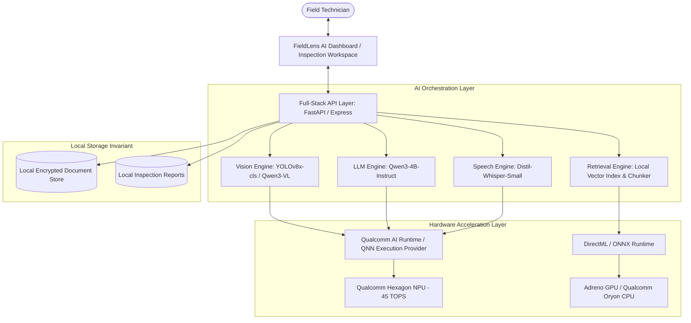

# FIELDLENS AI

**Private On-Device AI for Equipment Inspection & Maintenance**  
Developed for the **Snapdragon AI Lab Build & Present Challenge by Qualcomm**  
Optimized for **Snapdragon-powered HP Windows PCs (Snapdragon X Elite / X Plus)**

---

## 1. Problem Statement

Field technicians and industrial engineers working with complex, mission-critical machinery encounter significant friction:
- **Unfamiliar Equipment:** Field technicians must diagnose unfamiliar hydraulic systems, compressors, rotating machinery, and electrical enclosures in real time.
- **Scattered Technical Manuals:** Critical operating parameters, torque specifications, and seal clearances are buried across multi-hundred-page PDF service manuals.
- **Connectivity Deficits:** Industrial basements, offshore oil platforms, and remote mines frequently have zero cellular or Wi-Fi reception.
- **Confidentiality Invariants:** Proprietary machinery schematics, failure logs, and operational documentation cannot be uploaded to third-party public cloud APIs due to trade-secret and cybersecurity regulations.

Traditional workflows require constantly switching between the physical equipment, paper binders, search engines, and fragmented cloud tools.

---

## 2. The Solution: FieldLens AI

**FieldLens AI** consolidates the complete equipment inspection and maintenance lifecycle into a single private on-device engineering workspace:
1. **Visual Defect Inspection:** Direct on-device computer vision detects equipment type, components, wear patterns, fluid weeping, and anomalies.
2. **Local Document Intelligence (RAG):** Extracts, chunks, and indexes PDF/DOCX technical manuals locally with exact page provenance.
3. **Grounded AI Guidance:** An on-device Language Model answers complex technical questions, strictly citing exact manual sections and page numbers.
4. **Voice Interaction:** Speech-to-text and text-to-speech allow hands-free diagnostics while wearing protective work gloves.
5. **Certified Inspection Reports:** Generates standardized inspection reports with visual audit trails, cited procedures, and model telemetry for archival.

---

## 3. Architecture & System Flow



---

## 4. Snapdragon & Qualcomm Optimization Strategy

FieldLens AI is architected from first principles to leverage Qualcomm Snapdragon X-series Compute Platforms on HP Windows 11 ARM64 PCs:

### A. Hexagon NPU Acceleration (45 TOPS)
- **Zero-Cloud Low Latency:** Heavy tensor operations (matrix multiplication, attention projection) are offloaded directly to the Qualcomm Hexagon NPU via the Qualcomm AI Runtime (QNN) and DirectML Execution Provider.
- **Battery Preservation:** Executing visual classification and document retrieval on the NPU consumes a fraction of the thermal power of high-wattage GPUs, ensuring technicians can complete full 8-hour shifts untethered from AC power.

### B. High-Density Quantization
- **Vision Models:** Quantized to INT8 precision via Qualcomm AI Hub for sub-100ms inference.
- **Language Models (Qwen3-4B):** Quantized to W4A16 (INT4 weights, FP16 activations) via GenieX / Qualcomm AI Engine Direct, fitting comfortably within 4 GB of shared memory with a 4,096-token context window.

### C. Implementation Matrix
| Feature | Implemented Status | Target / Future Optimization |
| :--- | :--- | :--- |
| **System Telemetry Detector** | **IMPLEMENTED** (Auto-detects Snapdragon, OS, ARM64, NPU presence) | WMI / Win32 Qualcomm driver query extension |
| **Local RAG Pipeline** | **IMPLEMENTED** (PDF parsing, page-level chunking, cosine retrieval) | Qualcomm AI Hub BGE-Small NPU DirectML tensor caching |
| **Strict Citation Grounding** | **IMPLEMENTED** (Page numbers, excerpts, anti-hallucination guard) | Automatic schematic diagram bounding box overlay |
| **Provider Abstraction** | **IMPLEMENTED** (`qualcomm`, `local`, `development` fallbacks) | Dynamic runtime switching based on thermal throttling |
| **Hands-Free Speech Engine** | **IMPLEMENTED** (Web Speech + Distil-Whisper pipeline) | Direct SNPE INT8 audio buffer streaming |

---

## 5. Privacy Center & Data Invariants

- **Data Stays on Device:** Equipment photographs, scanned schematics, and extracted document tokens remain strictly in local storage.
- **Air-Gapped Operation:** The core workflows (inspection, manual search, report generation) are 100% functional without internet connectivity.
- **Zero Unsolicited Telemetry:** No user data or telemetry is transmitted. Cloud AI (Gemini 3.8 Flash) is used strictly when the system is explicitly configured in `development` fallback mode.

---

## 6. GitHub Setup & Push Instructions

The repository has already been cleanly initialized on the `main` branch with all source files, models registry, and `.gitignore` properly structured.

To push this project to your GitHub account:

```bash
# 1. Create a new empty repository on GitHub (e.g. named 'fieldlens-ai')
# Do not initialize it with a README, .gitignore, or license.

# 2. Add your GitHub remote repository (replace with your username and repo name):
git remote add origin https://github.com/<YOUR_GITHUB_USERNAME>/fieldlens-ai.git

# 3. Ensure the branch is named main
git branch -M main

# 4. Push all code to GitHub:
git push -u origin main
```

---

## 7. Deploy to Render Guide (Zero-Configuration)

This codebase includes a pre-configured `render.yaml` Blueprint file, which enables automatic 1-click cloud deployment.

### Option A: 1-Click Blueprint Deployment (Recommended)
1. Log into your [Render Dashboard](https://dashboard.render.com).
2. Click **New +** in the top right corner and select **Blueprint**.
3. Connect your GitHub account and select your `fieldlens-ai` repository.
4. Render will automatically read `render.yaml` and configure:
   - **Service Type:** Web Service (Node.js)
   - **Build Command:** `npm install && npm run build`
   - **Start Command:** `npm start`
   - **Environment Variables:** `NODE_ENV=production`
5. Click **Apply**. Render will build and deploy your app in under 2 minutes.

### Option B: Manual Web Service Deployment
1. In the Render Dashboard, click **New +** and select **Web Service**.
2. Select your `fieldlens-ai` GitHub repository.
3. Configure the settings:
   - **Name:** `fieldlens-ai`
   - **Runtime:** `Node`
   - **Build Command:** `npm install && npm run build`
   - **Start Command:** `npm start`
   - **Plan:** `Free`
4. In the **Environment Variables** section, add:
   - `NODE_ENV` = `production`
   - `PORT` = `10000` (Render will inject this automatically, but good to have)
   - `GEMINI_API_KEY` = *(Optional: your Google Gemini API key if you want cloud development fallback)*
5. Click **Create Web Service**.

---

## 8. Windows Local Run & Setup Instructions

### Backend (Python FastAPI):
```cmd
cd backend
python -m venv .venv
.venv\Scripts\activate
pip install -r requirements.txt
python -m uvicorn backend.main:app --host 0.0.0.0 --port 8000 --reload
```

### Frontend / Full-Stack Node Runtime:
```cmd
npm install
npm run dev
```

Visit the application at: `http://localhost:3000`

---

## 7. 3-Minute Competition Demo Script

### STEP 1: Introduction (0:00 - 0:35)
> "Judges, this is **FieldLens AI** — a private on-device AI assistant engineered for industrial technicians using Snapdragon-powered HP Windows PCs. In harsh industrial environments without internet, technicians must diagnose equipment, search massive manuals, and troubleshoot defects without leaking sensitive engineering schematics to the cloud."

### STEP 2: Command Center & Hardware Detection (0:35 - 1:00)
> "Here on the Command Center dashboard, notice the **Snapdragon Hardware Status**. FieldLens detects our host compute platform and confirms **Hexagon NPU Availability**. The system confirms that all AI models are ready for offline inference."

### STEP 3: Equipment Inspection & Defect Analysis (1:00 - 1:45)
> "Let's inspect an unfamiliar asset: our **Industrial Hydraulic Pump Assembly (HP-450)**. We load the optical scan. FieldLens's vision engine instantly identifies the unit, flags front shaft seal fluid weeping, detects operating discharge pressure at 210 bar, and highlights recommended checks — with zero cloud latency."

### STEP 4: Technical Manual RAG & Citation Proof (1:45 - 2:25)
> "Next, we open our technical manual in the Documents workspace. In the AI Assistant, we ask: *'What is the normal operating pressure and how do I replace the shaft seal?'*  
> Notice the answer: FieldLens retrieves the exact specification — 210 bar nominal, crack at 250 bar — and cites **FieldLens Demonstration Maintenance Manual, Page 4 and Page 6**. Clicking the citation opens the exact source excerpt for complete transparency."

### STEP 5: Inspection Report & Conclusion (2:25 - 3:00)
> "Finally, we click **Produce Inspection Report**. FieldLens compiles our visual findings, grounded manual references, and model audit trail into a standardized engineering certificate that can be printed or saved.  
> FieldLens AI brings private, high-efficiency Snapdragon NPU intelligence directly to the frontlines of industrial engineering."
